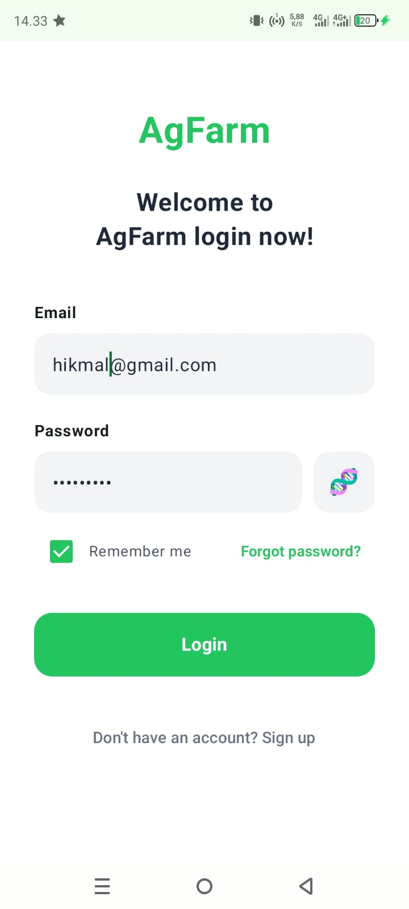
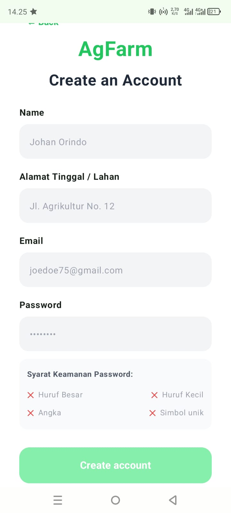
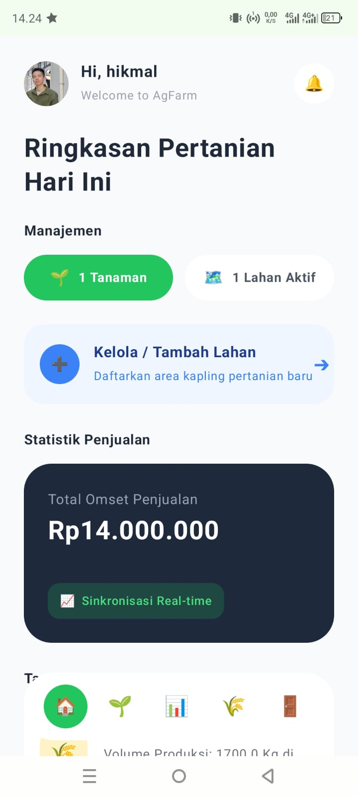
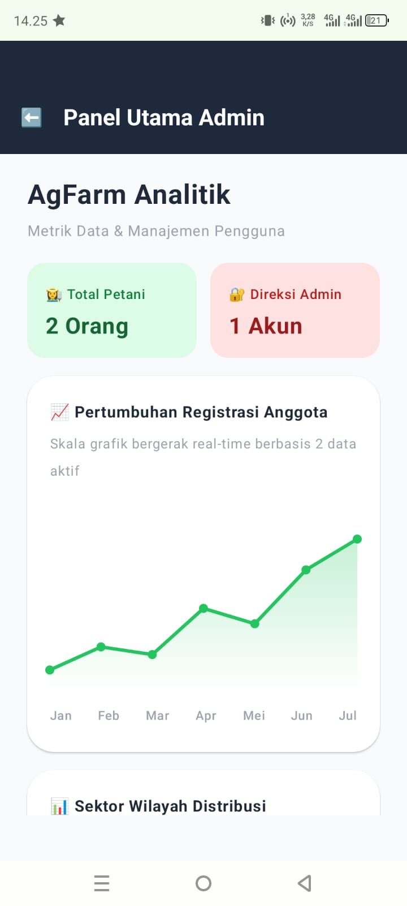
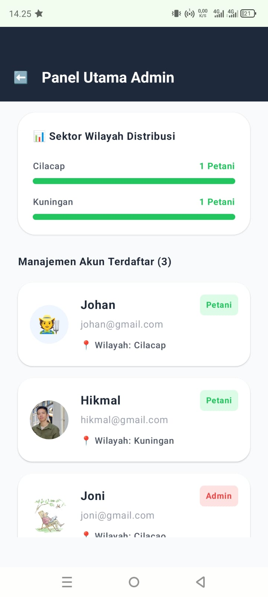

# 🌾 AgFarm Mobile - Sistem Manajemen Pertanian Digital (Android)

<p align="center">
  
  
  
  
</p>

---

### 📝 Deskripsi Singkat
> **AgFarm Mobile** adalah aplikasi Android berbasis Jetpack Compose yang dirancang khusus untuk para petani dalam mengelola distribusi lahan, memantau varietas tanaman, mencatat log panen terdekat, serta melacak transaksi omset penjualan secara real-time. Dilengkapi dengan sinkronisasi Firebase dan keamanan biometrik lokal untuk proteksi penuh data pertanian Anda.

---

## 📱 Modul & Tampilan Aplikasi

### 1. Splash & Login Screen
*Gerbang masuk utama aplikasi yang dilengkapi fitur simpan sandi aman (Remember Me) dan login instan menggunakan sidik jari.*


### 2. Register Screen
*Halaman pendaftaran akun petani baru lengkap dengan indikator pemenuhan syarat keamanan password yang interaktif.*


### 3. Dashboard Utama (Home Screen)
*Pusat ringkasan informasi harian yang menyajikan total omset, jumlah tanaman aktif, kapling lahan, serta log aktivitas panen terbaru milik pengguna.*


### 4. Panel Administrasi (Khusus Admin)
*Fitur panel rahasia yang hanya muncul jika pengguna masuk menggunakan role Admin untuk memantau data seluruh petani.*

*Informasi data user pada halaman admin dan ada beberapa mitra terdaftar pada sistem AgFarm.*


## 🛠️ Tech Stack & Fitur Unggulan
* **UI Framework:** Full Jetpack Compose (Declarative UI) dengan Material Design 3.
* **Database & Auth:** Firebase Authentication & Firebase Realtime Database.
* **Local Security storage:** EncryptedSharedPreferences (Kriptografi AES256 untuk keamanan kredensial).
* **Biometric Auth:** Integrasi Android BiometricPrompt untuk login praktis via Sidik Jari / Face Unlock.
* **Screen Anti-Capture:** Mengaktifkan `FLAG_SECURE` melalui WindowManager untuk mencegah screenshot dan screen recording dari pihak ketiga.
* **Arsitektur Kode:** Mengikuti pola MVVM (Model-View-ViewModel) dengan StateFlow untuk manajemen state yang reaktif dan anti-bocor data antar pengguna.

---

## 🚀 Cara Menjalankan di Lokal (Local Development Setup)

Ikuti langkah-langkah berikut untuk mengkloning dan menjalankan proyek AgFarm Mobile di Android Studio Anda:

1. **Clone Repository**
   Kloning proyek ini dari GitHub ke dalam folder lokal Anda:
   ```bash
   git clone [https://github.com/Hikmal-source/AgFarm-Mobile.git](https://github.com/Hikmal-source/AgFarm-Mobile.git) agfarm-mobile